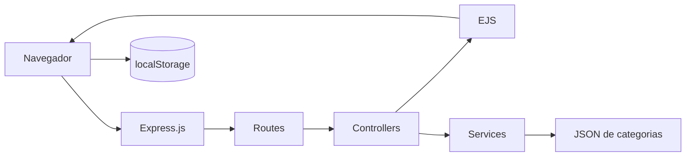

<h1 align="center">Meu Bolso</h1>

<p align="center">
  Aplicação web acadêmica de controle financeiro pessoal desenvolvida com Node.js, Express.js, EJS e JavaScript no navegador.
</p>

<p align="center">
  
  
  
  
  
</p>

## Sumário

- [Sobre o projeto](#sobre-o-projeto)
- [Funcionalidades](#funcionalidades)
- [Demonstração](#demonstração)
- [Arquitetura](#arquitetura)
- [Estrutura do repositório](#estrutura-do-repositório)
- [Tecnologias](#tecnologias)
- [Persistência local](#persistência-local)
- [Configuração](#configuração)
- [Como executar](#como-executar)
- [Scripts disponíveis](#scripts-disponíveis)
- [Testes](#testes)
- [Documentação técnica](#documentação-técnica)
- [Limitações](#limitações)
- [Contribuição](#contribuição)
- [Licença](#licença)

## Sobre o projeto

O Meu Bolso é uma aplicação web acadêmica para registro e acompanhamento de receitas e despesas. O backend utiliza Express.js para organizar rotas, processar o formulário de contato e renderizar páginas EJS. No navegador, módulos JavaScript controlam o CRUD das transações, filtros, relatórios e cálculos apresentados no dashboard.

A persistência da carteira simulada é realizada por meio do `localStorage`, mantendo os dados exclusivamente no navegador utilizado. Essa decisão faz parte do escopo acadêmico do projeto e elimina a necessidade de banco de dados nesta versão.

## Funcionalidades

- Dashboard com saldo, receitas, despesas e últimos lançamentos.
- Cadastro de receitas e despesas no navegador.
- Edição de transações.
- Exclusão com confirmação em modal.
- Filtro por descrição, categoria e tipo.
- Ordenação por data ou valor.
- Relatórios consolidados por categoria.
- Categorias predefinidas carregadas de arquivo JSON.
- Sugestões locais de categorias.
- Formulário de contato validado no servidor.
- Páginas personalizadas para 404 e erro interno.
- Interface responsiva com Tailwind CSS e daisyUI.

Status: implementação parcial

- O formulário de contato valida os dados e redireciona, mas não envia e-mail nem salva mensagens.
- As sugestões de categorias ficam apenas no navegador e não alteram o arquivo de categorias oficiais.

## Demonstração

> As capturas da interface serão adicionadas em `docs/images/`.

Rotas principais para demonstração local:

- `GET /`
- `GET /transacoes`
- `GET /categorias`
- `GET /relatorios`
- `GET /sobre`

## Arquitetura

A aplicação segue uma arquitetura monolítica modular. O Express.js renderiza páginas EJS e serve os assets. O navegador executa a lógica financeira simulada e persiste a carteira no `localStorage`.



A documentação técnica detalha os módulos, fluxos, validators, services, views e scripts do navegador.

## Estrutura do repositório

```text
src/
├── app.js
├── server.js
├── config/
├── controllers/
├── middlewares/
├── public/
│   ├── css/
│   ├── data/
│   ├── images/
│   └── js/
├── routes/
├── services/
├── styles/
├── utils/
├── validators/
└── views/
tests/
├── integration/
└── unit/
docs/
└── DOCUMENTACAO-TECNICA.md
```

Diretórios principais:

- `src/routes`: definição de URLs e métodos HTTP.
- `src/controllers`: preparação de view models e respostas.
- `src/services`: lógica reutilizável de carregamento de categorias.
- `src/views`: layout, páginas, partials e erros EJS.
- `src/public/js`: módulos do navegador para storage, validação, DOM, dashboard, transações e relatórios.
- `tests`: testes unitários e de integração.

## Tecnologias

| Tecnologia   | Finalidade                 |
| ------------ | -------------------------- |
| Node.js      | Ambiente de execução       |
| Express.js   | Servidor HTTP e roteamento |
| EJS          | Renderização server-side   |
| JavaScript   | Comportamento no navegador |
| Tailwind CSS | Estilização                |
| daisyUI      | Componentes visuais        |
| Helmet       | Headers de segurança       |
| Vitest       | Testes unitários           |
| Supertest    | Testes de rotas            |
| ESLint       | Análise estática           |
| Prettier     | Formatação                 |

## Persistência local

> Este projeto utiliza `localStorage` para simular a persistência da carteira financeira. Os registros permanecem somente no navegador e não devem ser utilizados para armazenar informações financeiras reais.

Características:

- não há banco de dados;
- não há sincronização entre dispositivos;
- os dados ficam no perfil do navegador;
- limpar os dados do navegador remove os registros;
- o backend não recebe as transações financeiras;
- transações são armazenadas em schema versionado;
- valores monetários são salvos em centavos inteiros.

Chave principal:

```text
meubolso:v2:transactions
```

## Configuração

Crie um arquivo local de configuração a partir do exemplo:

```bash
cp .env.example .env
```

Variáveis reais:

| Variável   | Obrigatória | Valor padrão  | Finalidade        |
| ---------- | ----------: | ------------- | ----------------- |
| `NODE_ENV` |         Não | `development` | Define o ambiente |
| `PORT`     |         Não | `3030`        | Porta HTTP        |

O código valida a porta no início da aplicação. Valores inválidos em `PORT` interrompem a inicialização.

## Como executar

Requisitos:

- Node.js 20 ou superior recomendado;
- npm.

Instalação:

```bash
git clone <url-do-repositorio>
cd meu-bolso
npm install
cp .env.example .env
```

Execução em desenvolvimento:

```bash
npm run dev
```

Execução normal:

```bash
npm run build:css
npm start
```

Endereço padrão:

```text
http://localhost:3030
```

## Scripts disponíveis

| Comando                 | Descrição                                    |
| ----------------------- | -------------------------------------------- |
| `npm run dev`           | Executa a aplicação com `nodemon`            |
| `npm run build:css`     | Gera o CSS final em `src/public/css/app.css` |
| `npm run watch:css`     | Observa alterações de CSS                    |
| `npm start`             | Inicia a aplicação com Node.js               |
| `npm test`              | Executa os testes                            |
| `npm run test:coverage` | Executa testes com cobertura                 |
| `npm run lint`          | Verifica o código com ESLint                 |
| `npm run format`        | Formata os arquivos com Prettier             |
| `npm run format:check`  | Verifica formatação                          |
| `npm run check`         | Executa lint e testes                        |

## Testes

Ferramentas:

- Vitest para testes unitários;
- Supertest para testes de rotas Express;
- jsdom para simular APIs do navegador em testes do storage.

Executar testes:

```bash
npm test
```

Executar cobertura:

```bash
npm run test:coverage
```

Cenários cobertos:

- criação, atualização e exclusão de transações;
- cálculo de receitas, despesas e saldo;
- migração de dados legados do `localStorage`;
- tratamento de JSON corrompido;
- validação de transações;
- validação de contato;
- renderização das rotas principais;
- página 404;
- erro controlado na leitura de categorias.

## Documentação técnica

A documentação detalhada da arquitetura, dos módulos, das rotas, da persistência e dos fluxos internos está disponível em:

- [`docs/DOCUMENTACAO-TECNICA.md`](docs/DOCUMENTACAO-TECNICA.md)

## Limitações

- Persistência somente local.
- Ausência de contas de usuário.
- Ausência de autenticação.
- Ausência de sincronização entre dispositivos.
- Ausência de banco de dados.
- Ausência de recuperação remota.
- Dependência do armazenamento do navegador.
- Formulário de contato sem envio real de mensagem.
- Uso exclusivamente acadêmico e demonstrativo.

## Contribuição

1. Faça um fork do repositório.
2. Crie uma branch:

   ```bash
   git checkout -b feat/minha-alteracao
   ```

3. Realize as alterações e execute as verificações:

   ```bash
   npm run check
   npm run format:check
   ```

4. Crie o commit:

   ```bash
   git commit -m "feat: descreve a alteração"
   ```

5. Envie a branch:

   ```bash
   git push origin feat/minha-alteracao
   ```

6. Abra um Pull Request.

## Licença

O `package.json` declara licença ISC. Não há arquivo `LICENSE` no repositório nesta versão.
