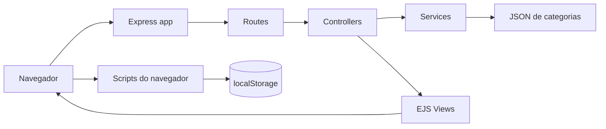
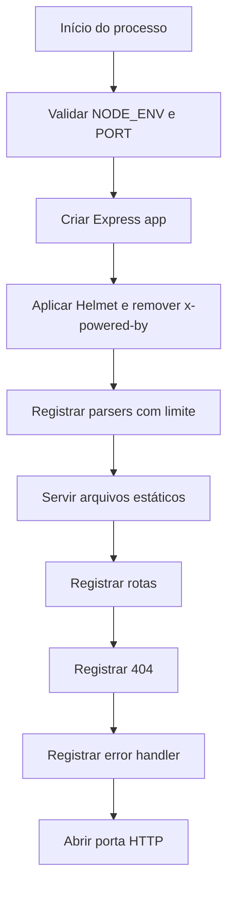
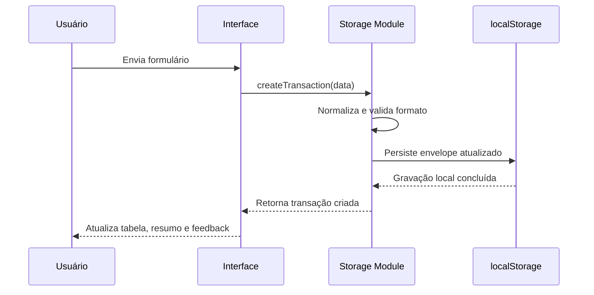
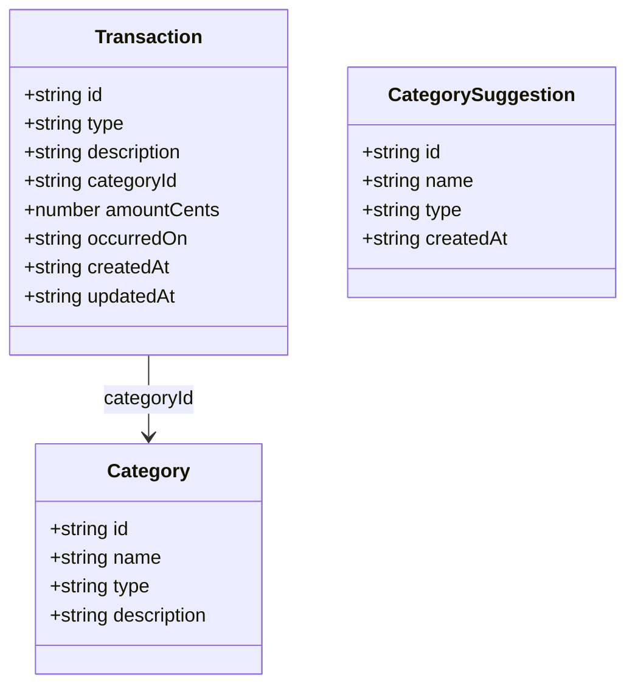
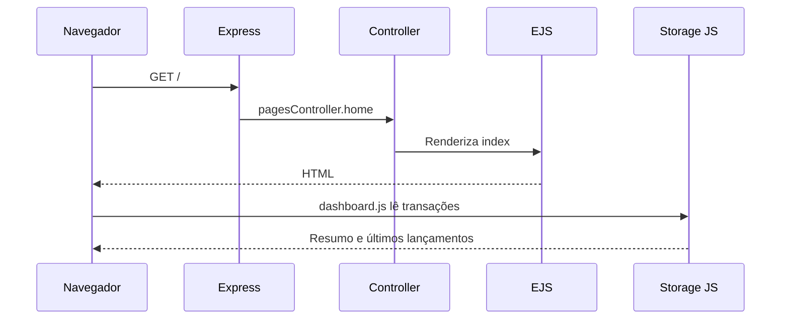
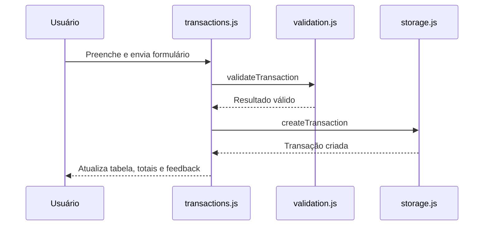
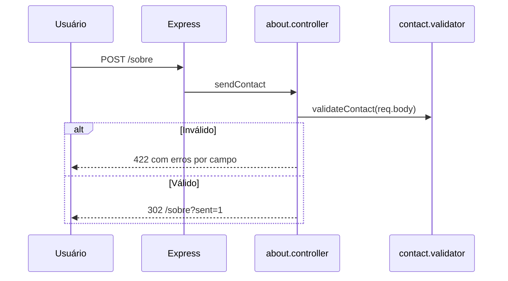
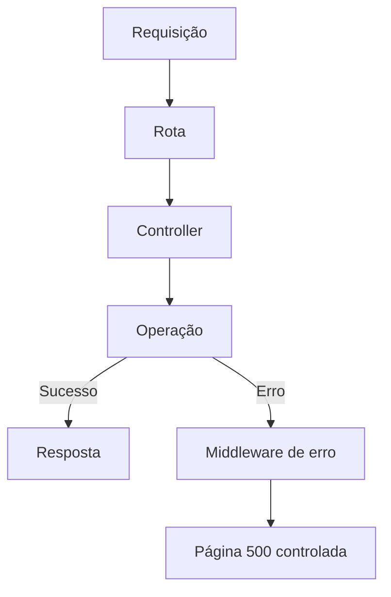

# Documentação Técnica — Meu Bolso

## 1. Identificação do projeto

| Informação                            | Valor                                    |
| ------------------------------------- | ---------------------------------------- |
| Nome oficial                          | Meu Bolso                                |
| Versão                                | 1.0.0                                    |
| Tipo                                  | Aplicação web server-rendered            |
| Contexto                              | Projeto acadêmico                        |
| Backend                               | Node.js com Express.js                   |
| Template engine                       | EJS                                      |
| Frontend                              | HTML, CSS e JavaScript sem framework SPA |
| Estilização                           | Tailwind CSS e daisyUI                   |
| Persistência da carteira              | `localStorage` do navegador              |
| Testes                                | Vitest e Supertest                       |
| Última atualização desta documentação | 2026-07-10                               |

O Meu Bolso é uma aplicação acadêmica de controle financeiro pessoal. O backend organiza rotas, renderiza páginas EJS, processa o formulário de contato e serve arquivos estáticos. O navegador executa o CRUD da carteira simulada, calcula totais e persiste transações no `localStorage`.

## 2. Escopo do sistema

O sistema atende ao problema acadêmico de registrar e visualizar receitas e despesas em uma interface web simples. O objetivo é demonstrar organização de uma aplicação Express.js com EJS, separação mínima de responsabilidades, componentes visuais reutilizáveis e manipulação segura de dados no navegador.

Funcionalidades implementadas:

- dashboard com saldo, receitas, despesas e últimos lançamentos;
- cadastro de receitas e despesas no navegador;
- edição de transações;
- exclusão de transações com confirmação em modal;
- filtros por texto, tipo e ordenação;
- relatórios por categoria;
- categorias predefinidas carregadas de JSON estático;
- sugestões locais de categorias armazenadas no navegador;
- página sobre com formulário de contato validado no servidor;
- páginas 404 e 500 personalizadas;
- build local de CSS com Tailwind CSS e daisyUI;
- testes unitários e de integração.

Status: implementação parcial:

- o formulário de contato valida e redireciona, mas não envia e-mail nem persiste mensagens;
- sugestões de categorias são uma simulação local no navegador e não alteram a lista oficial de categorias.

Fora de escopo nesta versão:

- banco de dados;
- autenticação;
- autorização;
- sincronização entre dispositivos;
- recuperação remota de dados;
- uso financeiro real;
- API REST pública;
- Docker;
- integrações externas reais.

## 3. Arquitetura geral

A aplicação utiliza uma arquitetura monolítica modular. O Express.js inicializa middlewares, registra rotas e renderiza views EJS. O EJS entrega HTML server-rendered ao navegador. A lógica financeira da carteira simulada roda no frontend, usando módulos JavaScript em `src/public/js`.

Responsabilidades principais:

- Express.js: servidor HTTP, headers de segurança, parsing de formulários, arquivos estáticos, rotas, 404 e 500.
- Rotas: definem URLs e delegam para controllers.
- Controllers: preparam view models, chamam services quando necessário, renderizam views e redirecionam.
- Services: isolam lógica reutilizável de carregamento de categorias.
- Validators: validam formulários processados pelo servidor e entradas do frontend.
- Views EJS: compõem páginas e partials.
- Navegador: executa CRUD de transações, filtros, relatórios, feedback visual e persistência em `localStorage`.



## 4. Estrutura de diretórios

Árvore real da aplicação:

```text
src/
  app.js
  server.js
  config/
    env.js
    paths.js
  controllers/
    about.controller.js
    categories.controller.js
    pages.controller.js
  middlewares/
    error.middleware.js
    not-found.middleware.js
  public/
    css/
      app.css
    data/
      categorias.json
    images/
      favicon.svg
      logo.svg
    js/
      core/
        currency.js
        dom.js
        storage.js
        validation.js
      pages/
        about.js
        categories.js
        dashboard.js
        reports.js
        transactions.js
  routes/
    about.routes.js
    categories.routes.js
    index.routes.js
    reports.routes.js
    transactions.routes.js
  services/
    categories.service.js
  styles/
    input.css
  utils/
    async-handler.js
  validators/
    category.validator.js
    contact.validator.js
  views/
    errors/
      404.ejs
      500.ejs
    layouts/
      main.ejs
    pages/
      about.ejs
      categories.ejs
      index.ejs
      reports.ejs
      transactions.ejs
    partials/
      alerts.ejs
      empty-state.ejs
      footer.ejs
      form-field.ejs
      head.ejs
      header.ejs
tests/
  integration/
    routes.test.js
  unit/
    storage.test.js
    validation.test.js
docs/
  DOCUMENTACAO-TECNICA.md
```

Responsabilidades:

- `src/app.js`: cria e configura a instância Express.
- `src/server.js`: abre a porta HTTP e trata encerramento.
- `src/config`: configuração de ambiente e caminhos.
- `src/routes`: roteadores Express.
- `src/controllers`: adaptação entre HTTP e views.
- `src/services`: lógica reutilizável de categorias.
- `src/middlewares`: 404 e tratamento centralizado de erro.
- `src/validators`: validação de formulários.
- `src/views`: layout, páginas, partials e erros EJS.
- `src/public`: assets servidos ao navegador.
- `src/styles`: entrada do Tailwind CSS.
- `tests`: testes unitários e de integração.
- `docs`: documentação técnica.

## 5. Inicialização da aplicação

Arquivo de entrada normal: `src/server.js`.

Fluxo de inicialização:



Ordem real em `src/app.js`:

1. criação do `app`;
2. desativação de `x-powered-by`;
3. configuração de `view engine` EJS e diretório de views;
4. Helmet com CSP compatível com assets locais;
5. `express.urlencoded({ extended: false, limit: "50kb" })`;
6. `express.json({ limit: "50kb" })`;
7. `express.static()` apontando para `src/public`;
8. rotas de páginas;
9. middleware 404;
10. middleware de erro.

`src/server.js` abre a porta configurada e trata `SIGINT` e `SIGTERM`, fechando o servidor HTTP antes de encerrar o processo.

## 6. Configuração e variáveis de ambiente

Variáveis reais:

| Variável   | Obrigatória | Valor padrão  | Finalidade                    |
| ---------- | ----------: | ------------- | ----------------------------- |
| `NODE_ENV` |         Não | `development` | Define o ambiente de execução |
| `PORT`     |         Não | `3030`        | Porta HTTP                    |

O arquivo `.env.example` contém somente as variáveis utilizadas. O código atual não carrega `.env` automaticamente; variáveis devem ser fornecidas pelo ambiente ou shell. Para desenvolvimento local, o arquivo pode ser copiado como referência:

```bash
cp .env.example .env
```

`src/config/env.js` valida `PORT`. Se a porta informada não for um inteiro entre 1 e 65535, a aplicação falha na inicialização com erro explícito.

Dados que não devem ser versionados:

- arquivos `.env`;
- segredos;
- tokens;
- credenciais;
- logs locais.

## 7. Rotas da aplicação

| Método   | Rota             | Controller                            | View ou resposta              | Finalidade                                |
| -------- | ---------------- | ------------------------------------- | ----------------------------- | ----------------------------------------- |
| `GET`    | `/`              | `pagesController.home`                | `pages/index.ejs`             | Exibe dashboard                           |
| `GET`    | `/transacoes`    | `pagesController.transactions`        | `pages/transactions.ejs`      | Exibe CRUD local de transações            |
| `GET`    | `/categorias`    | `categoriesController.showCategories` | `pages/categories.ejs`        | Exibe categorias e sugestões locais       |
| `GET`    | `/relatorios`    | `pagesController.reports`             | `pages/reports.ejs`           | Exibe relatórios calculados no navegador  |
| `GET`    | `/sobre`         | `aboutController.showAbout`           | `pages/about.ejs`             | Exibe informações e formulário de contato |
| `POST`   | `/sobre`         | `aboutController.sendContact`         | Redirect ou `pages/about.ejs` | Valida formulário de contato              |
| Qualquer | rota inexistente | `notFound`                            | `errors/404.ejs`              | Exibe página 404                          |

### `GET /`

- Parâmetros: nenhum.
- Query parameters: nenhum.
- Resposta: HTML.
- Status: `200`.
- Dados da view: `title`, `currentPage`, `greeting`.

### `GET /transacoes`

- Parâmetros: nenhum.
- Query parameters: nenhum.
- Resposta: HTML.
- Status: `200`.
- Dados da view: `categories`, `categoryStatus`, `today`.
- Tratamento de erro: se o JSON de categorias falhar, a página renderiza aviso e usa coleção vazia.

### `GET /categorias`

- Parâmetros: nenhum.
- Resposta: HTML.
- Status: `200`.
- Dados da view: `categories`, `categoryStatus`.

### `GET /relatorios`

- Parâmetros: nenhum.
- Resposta: HTML.
- Status: `200`.
- Dados da view: `categories`.

### `GET /sobre`

- Query parameter real: `sent=1`, usado para exibir mensagem de sucesso após redirect.
- Resposta: HTML.
- Status: `200`.

### `POST /sobre`

Body esperado:

| Campo     | Tipo   | Obrigatório | Regra                                    |
| --------- | ------ | ----------: | ---------------------------------------- |
| `name`    | string |         Sim | mínimo de 2 caracteres                   |
| `email`   | string |         Sim | formato de e-mail válido                 |
| `message` | string |         Sim | mínimo de 10 e máximo de 1000 caracteres |

Status possíveis:

- `302`: formulário válido, redireciona para `/sobre?sent=1`;
- `422`: formulário inválido, renderiza `pages/about.ejs` com erros por campo.

O formulário não persiste dados e não registra conteúdo pessoal em logs.

## 8. Controllers

### `pages.controller.js`

Responsável por páginas gerais.

| Função         | Entrada                                   | Saída | Responsabilidade                                 |
| -------------- | ----------------------------------------- | ----- | ------------------------------------------------ |
| `renderPage`   | `res`, nome da página, view model, status | HTML  | Renderiza `layouts/main` com a página solicitada |
| `home`         | `req`, `res`                              | HTML  | Renderiza dashboard com saudação                 |
| `transactions` | `req`, `res`                              | HTML  | Carrega categorias e renderiza CRUD              |
| `reports`      | `req`, `res`                              | HTML  | Carrega categorias e renderiza relatórios        |

Services utilizados:

- `categories.service.js` em `transactions` e `reports`.

Views renderizadas:

- `pages/index.ejs`;
- `pages/transactions.ejs`;
- `pages/reports.ejs`.

### `categories.controller.js`

Responsável pela página de categorias.

| Função           | Entrada      | Saída | Responsabilidade                             |
| ---------------- | ------------ | ----- | -------------------------------------------- |
| `showCategories` | `req`, `res` | HTML  | Carrega categorias e status do JSON estático |

Service utilizado:

- `categories.service.js`.

View renderizada:

- `pages/categories.ejs`.

### `about.controller.js`

Responsável pela página sobre e formulário de contato.

| Função        | Entrada      | Saída            | Responsabilidade                          |
| ------------- | ------------ | ---------------- | ----------------------------------------- |
| `showAbout`   | `req`, `res` | HTML             | Renderiza página sobre                    |
| `sendContact` | `req`, `res` | HTML ou redirect | Valida contato e aplica Post/Redirect/Get |

Validator utilizado:

- `contact.validator.js`.

Redirect realizado:

- `/sobre?sent=1` após formulário válido.

## 9. Services

### `categories.service.js`

Responsabilidade: carregar, normalizar, validar e cachear categorias do arquivo `src/public/data/categorias.json`.

Dependências:

- `fs/promises`;
- `path`;
- `src/config/paths.js`.

Funções públicas:

| Função                 | Entrada | Saída                          | Responsabilidade                |
| ---------------------- | ------- | ------------------------------ | ------------------------------- |
| `getCategories`        | nenhuma | `Promise<Array>`               | Retorna categorias normalizadas |
| `getCategoryStatus`    | nenhuma | `Promise<{hasError, message}>` | Retorna status de carregamento  |
| `resetCategoriesCache` | nenhuma | `void`                         | Limpa cache, usado em testes    |

Regras aplicadas:

- leitura assíncrona;
- cache após primeira leitura;
- normalização de campos legados `nome`, `tipo`, `descricao`;
- aceitação de tipos `income` e `expense`;
- conversão de `receita` para `income` e `despesa` para `expense`;
- remoção de categorias inválidas ou duplicadas;
- erro técnico registrado sem dados sensíveis.

Motivo do isolamento: o carregamento de categorias é usado por mais de uma página e envolve I/O, validação e cache.

## 10. Middlewares

Middlewares de terceiros e internos:

- Helmet: headers de segurança e CSP;
- `express.urlencoded`: parsing de formulários com limite de 50 KB;
- `express.json`: parsing JSON com limite de 50 KB;
- `express.static`: assets estáticos com `etag` e cache de 1 hora;
- `not-found.middleware.js`: página 404 controlada;
- `error.middleware.js`: página 500 controlada;
- `async-handler.js`: captura rejeições de promises em controllers async.

### Error handler

Arquivo: `src/middlewares/error.middleware.js`.

Comportamento:

- se headers já foram enviados, delega para o próximo handler;
- registra apenas a mensagem técnica do erro com `console.error`;
- renderiza `layouts/main` com `errors/500.ejs`;
- não expõe stack trace na resposta.

Em ambiente de teste (`NODE_ENV=test`), o middleware evita logar o erro para não poluir a saída da suíte.

## 11. Validators

### `contact.validator.js`

Campos:

| Campo     | Tipo   | Obrigatório | Regra                                    |
| --------- | ------ | ----------: | ---------------------------------------- |
| `name`    | string |         Sim | mínimo de 2 caracteres                   |
| `email`   | string |         Sim | formato básico válido                    |
| `message` | string |         Sim | mínimo de 10 e máximo de 1000 caracteres |

Retorno:

```js
{
  values: {},
  errors: {},
  isValid: true
}
```

Integração: `about.controller.js` usa o validator em `POST /sobre`. Em falha, renderiza a página com status `422`, preservando valores e mensagens por campo.

### `category.validator.js`

Campos:

| Campo  | Tipo   | Obrigatório | Regra                  |
| ------ | ------ | ----------: | ---------------------- |
| `name` | string |         Sim | mínimo de 3 caracteres |
| `type` | string |         Sim | `income` ou `expense`  |

Uso atual: o arquivo é compartilhável e possui cobertura unitária. A validação da sugestão local usada no navegador está implementada também em `src/public/js/core/validation.js` para execução sem round-trip HTTP.

### `src/public/js/core/validation.js`

Validações no navegador:

- data em `YYYY-MM-DD`;
- transação com tipo, descrição, categoria, valor em centavos e data;
- sugestão local de categoria.

## 12. Views EJS

### Layout

`src/views/layouts/main.ejs` define:

- estrutura HTML base;
- `lang="pt-BR"`;
- tema daisyUI;
- inclusão de `head`, `header`, página dinâmica e `footer`.

### Partials

| Partial           | Responsabilidade                                |
| ----------------- | ----------------------------------------------- |
| `head.ejs`        | meta tags, título, CSS e scripts core           |
| `header.ejs`      | marca, skip link e navegação responsiva         |
| `footer.ejs`      | informações institucionais e aviso de simulação |
| `alerts.ejs`      | alerta genérico controlado                      |
| `form-field.ejs`  | campo de formulário com erro associado          |
| `empty-state.ejs` | estado vazio reutilizável                       |

### Páginas

| View                     | Dados esperados                         | Finalidade                         |
| ------------------------ | --------------------------------------- | ---------------------------------- |
| `pages/index.ejs`        | `greeting`                              | Dashboard inicial                  |
| `pages/transactions.ejs` | `categories`, `categoryStatus`, `today` | CRUD local de transações           |
| `pages/categories.ejs`   | `categories`, `categoryStatus`          | Categorias e sugestões locais      |
| `pages/reports.ejs`      | `categories`                            | Relatórios calculados no navegador |
| `pages/about.ejs`        | `contact`                               | Sobre e contato                    |
| `errors/404.ejs`         | `requestedUrl`                          | Página não encontrada              |
| `errors/500.ejs`         | nenhum dado específico                  | Erro interno controlado            |

Convenções:

- usar `<%= %>` para dados dinâmicos escapados;
- restringir `<%- %>` a includes e JSON controlado pelo servidor;
- views recebem dados prontos;
- cálculos financeiros não ficam em EJS.

## 13. Frontend e scripts do navegador

### Core

| Arquivo         | Responsabilidade                                                |
| --------------- | --------------------------------------------------------------- |
| `storage.js`    | API única para transações e sugestões no `localStorage`         |
| `currency.js`   | formatação de moeda, parsing para centavos e formatação de data |
| `validation.js` | validação client-side de transações e sugestões                 |
| `dom.js`        | criação segura de elementos e mensagens de erro                 |

### Scripts de página

| Arquivo           | Eventos e efeitos                                                                         |
| ----------------- | ----------------------------------------------------------------------------------------- |
| `dashboard.js`    | lê transações, calcula resumo, renderiza últimos lançamentos                              |
| `transactions.js` | controla formulário, valida, cria, edita, exclui, filtra, ordena, atualiza totais e modal |
| `categories.js`   | valida e salva sugestões locais de categoria                                              |
| `reports.js`      | agrupa transações por categoria e renderiza barras com `<progress>`                       |
| `about.js`        | desabilita botão durante envio do formulário de contato                                   |

Segurança no DOM:

- dados de usuário são inseridos com `textContent`;
- tabelas são criadas com `createElement`;
- não há `innerHTML` com dados de usuário nos scripts refatorados.

## 14. Persistência com `localStorage`

Chaves utilizadas:

| Chave                              | Finalidade                           |
| ---------------------------------- | ------------------------------------ |
| `meubolso:v2:transactions`         | Envelope versionado de transações    |
| `meubolso:transacoes`              | Chave legada migrada automaticamente |
| `meubolso:v1:category-suggestions` | Sugestões locais de categoria        |

Envelope real de transações:

```json
{
  "version": 2,
  "transactions": [
    {
      "id": "uuid",
      "type": "expense",
      "description": "Internet",
      "categoryId": "housing",
      "amountCents": 12990,
      "occurredOn": "2026-07-10",
      "createdAt": "2026-07-10T20:00:00.000Z",
      "updatedAt": "2026-07-10T20:00:00.000Z"
    }
  ]
}
```

Operações suportadas por `storage.js`:

- `getTransactions()`;
- `getTransactionById(id)`;
- `createTransaction(data)`;
- `updateTransaction(id, data)`;
- `deleteTransaction(id)`;
- `clearTransactions()`;
- `calculateSummary(transactions)`;
- `getCategorySuggestions()`;
- `createCategorySuggestion(data)`;
- `clearCategorySuggestions()`.

IDs:

- usa `crypto.randomUUID()` quando disponível;
- usa fallback com timestamp e `Math.random()` quando necessário.

Valores monetários:

- são persistidos como centavos inteiros em `amountCents`;
- são formatados para BRL apenas na interface.

Tratamentos:

- JSON inválido na chave atual é removido e tratado como coleção vazia;
- dados legados da chave `meubolso:transacoes` são migrados para o schema atual;
- registros inválidos ou duplicados são descartados durante normalização;
- `createdAt` e `updatedAt` são preenchidos automaticamente.

Limitações:

- os dados ficam limitados ao navegador;
- não há sincronização;
- não há autenticação;
- não há backup no servidor;
- limpar dados do navegador remove os registros;
- o sistema não deve armazenar dados financeiros reais.



## 15. Modelo de dados

### Transaction

| Campo         | Tipo   | Obrigatório | Descrição                      |
| ------------- | ------ | ----------: | ------------------------------ |
| `id`          | string |         Sim | Identificador único            |
| `type`        | string |         Sim | `income` ou `expense`          |
| `description` | string |         Sim | Descrição exibida ao usuário   |
| `categoryId`  | string |         Sim | Identificador da categoria     |
| `amountCents` | number |         Sim | Valor em centavos              |
| `occurredOn`  | string |         Sim | Data em `YYYY-MM-DD`           |
| `createdAt`   | string |         Sim | Data ISO de criação            |
| `updatedAt`   | string |         Sim | Data ISO da última atualização |

### Category

| Campo         | Tipo   | Obrigatório | Descrição             |
| ------------- | ------ | ----------: | --------------------- |
| `id`          | string |         Sim | Identificador estável |
| `name`        | string |         Sim | Nome em português     |
| `type`        | string |         Sim | `income` ou `expense` |
| `description` | string |         Sim | Texto de apoio        |

### CategorySuggestion

| Campo       | Tipo   | Obrigatório | Descrição             |
| ----------- | ------ | ----------: | --------------------- |
| `id`        | string |         Sim | Identificador local   |
| `name`      | string |         Sim | Nome sugerido         |
| `type`      | string |         Sim | `income` ou `expense` |
| `createdAt` | string |         Sim | Data ISO de criação   |

### ContactForm

Não há persistência de mensagem. O modelo existe apenas como entrada validada em `POST /sobre`.



## 16. Regras de negócio

| Regra                                                      | Arquivo responsável                            |
| ---------------------------------------------------------- | ---------------------------------------------- |
| Receitas aumentam o saldo                                  | `src/public/js/core/storage.js`                |
| Despesas reduzem o saldo                                   | `src/public/js/core/storage.js`                |
| Valores monetários são armazenados em centavos             | `src/public/js/core/storage.js`, `currency.js` |
| Valor deve ser positivo                                    | `src/public/js/core/validation.js`             |
| Tipo deve ser `income` ou `expense`                        | `validation.js`, `storage.js`                  |
| Categoria deve existir na lista carregada                  | `transactions.js`, `validation.js`             |
| Data deve ser válida em `YYYY-MM-DD`                       | `validation.js`                                |
| IDs não usam índice de array                               | `storage.js`                                   |
| Exclusão exige confirmação                                 | `transactions.js`, `pages/transactions.ejs`    |
| JSON inválido do storage não quebra a interface            | `storage.js`                                   |
| Formulário de contato não persiste nem loga dados pessoais | `about.controller.js`                          |

## 17. Fluxos funcionais

### Abertura do dashboard



### Cadastro de receita ou despesa



### Edição

1. Usuário aciona "Editar".
2. `transactions.js` chama `getTransactionById(id)`.
3. O formulário é preenchido.
4. Usuário envia alterações.
5. `updateTransaction(id, data)` preserva `id` e `createdAt`.
6. Interface atualiza tabela e resumo.

### Exclusão

1. Usuário aciona "Excluir".
2. Modal nativo `<dialog>` é aberto.
3. Confirmação chama `deleteTransaction(id)`.
4. Interface atualiza tabela e resumo.

### Filtragem e ordenação

`transactions.js` filtra em memória por descrição ou categoria, aplica filtro por tipo e ordena por data ou valor.

### Relatórios

`reports.js` lê transações, agrupa por categoria e renderiza barras com `<progress>`.

### Formulário processado pelo servidor



### Carregamento de categorias

1. Controller chama `categoriesService.getCategories()`.
2. Service lê `categorias.json` de forma assíncrona na primeira chamada.
3. Conteúdo é normalizado e cacheado.
4. Em erro, retorna coleção vazia e status de aviso.

## 18. Segurança

Medidas existentes:

- Helmet com Content Security Policy;
- `x-powered-by` desativado;
- limite de payload em formulários e JSON;
- escaping EJS com `<%= %>`;
- uso de `textContent` e `createElement` para dados de usuário;
- ausência de `innerHTML` com dados de usuário nos scripts refatorados;
- validação client-side de transações e sugestões;
- validação server-side do formulário de contato;
- página 500 controlada sem stack trace;
- ausência de logs com nome, e-mail, mensagem ou dados financeiros;
- `.env` ignorado pelo Git.

### Limites de segurança

- não existe autenticação;
- não existe autorização por conta;
- dados não são isolados por usuário no servidor;
- dados permanecem no navegador;
- quem acessa o mesmo perfil do navegador acessa a carteira simulada;
- o projeto não é indicado para armazenar informações financeiras reais;
- o objetivo é acadêmico.

## 19. Interface, design system e acessibilidade

Biblioteca CSS:

- Tailwind CSS;
- daisyUI.

Build:

```bash
npm run build:css
```

Arquivos:

- `tailwind.config.js`: tema `meubolso`, cores e plugins;
- `src/styles/input.css`: entrada do Tailwind e ajustes de base;
- `src/public/css/app.css`: CSS gerado.

Padrões visuais:

- layout claro, objetivo e responsivo;
- cards para resumos;
- tabelas para transações e FAQ;
- badges para receita/despesa;
- alertas para feedback;
- modal `<dialog>` para exclusão;
- campos com labels e erros por campo.

Acessibilidade implementada:

- HTML em `pt-BR`;
- skip link para conteúdo principal;
- labels associados aos campos;
- `aria-describedby` para erros;
- `aria-live` em feedback dinâmico;
- botões reais para ações;
- foco visível;
- cabeçalhos e captions de tabelas;
- navegação responsiva.

## 20. Tratamento de erros

Fluxo:



Casos tratados:

- 404: `not-found.middleware.js` renderiza `errors/404.ejs`;
- 500: `error.middleware.js` renderiza `errors/500.ejs`;
- erro de leitura do JSON de categorias: service retorna coleção vazia e aviso;
- JSON inválido no `localStorage`: storage remove chave corrompida e retorna lista vazia;
- validação de contato: status `422` e erros por campo;
- erro inesperado: não expõe stack trace ao usuário.

## 21. Testes

| Tipo       | Ferramenta | Escopo                        |
| ---------- | ---------- | ----------------------------- |
| Unitário   | Vitest     | Storage, validação e cálculos |
| Integração | Supertest  | Rotas Express                 |

Arquivos:

- `tests/unit/storage.test.js`;
- `tests/unit/currency.test.js`;
- `tests/unit/validation.test.js`;
- `tests/integration/routes.test.js`.

Cenários cobertos:

- criação de transação;
- atualização de transação;
- exclusão de transação;
- cálculo de receitas, despesas e saldo;
- formatação de moeda, parsing para centavos e formatação de data;
- JSON inválido no storage;
- migração de dados legados;
- validação de transação;
- validação de valor;
- validação de data;
- validação de sugestão de categoria;
- validação de contato;
- renderização das rotas principais;
- página 404;
- formulário de contato inválido e válido;
- erro controlado na leitura de categorias.

Comandos:

```bash
npm test
npm run test:coverage
```

Observação operacional: Supertest abre uma porta efêmera para os testes de rota. Em ambientes com sandbox que bloqueiam `listen`, a suíte precisa ser executada em ambiente com permissão para abrir socket local.

## 22. Dependências

### Produção

| Dependência | Finalidade                 |
| ----------- | -------------------------- |
| `express`   | Servidor HTTP e roteamento |
| `ejs`       | Renderização server-side   |
| `helmet`    | Headers de segurança       |

### Desenvolvimento

| Dependência               | Finalidade                  |
| ------------------------- | --------------------------- |
| `@eslint/js`              | Configuração base do ESLint |
| `@tailwindcss/typography` | Plugin Tailwind             |
| `@vitest/coverage-v8`     | Relatório de cobertura      |
| `daisyui`                 | Componentes visuais         |
| `eslint`                  | Lint                        |
| `globals`                 | Globais para ESLint         |
| `jsdom`                   | Ambiente DOM dos testes     |
| `nodemon`                 | Execução em desenvolvimento |
| `prettier`                | Formatação                  |
| `supertest`               | Testes de rotas             |
| `tailwindcss`             | Build CSS                   |
| `vitest`                  | Testes                      |

## 23. Scripts do projeto

| Script                  | Comando                                                                      | Finalidade                |
| ----------------------- | ---------------------------------------------------------------------------- | ------------------------- |
| `npm run dev`           | `nodemon src/server.js`                                                      | Desenvolvimento           |
| `npm run build:css`     | `tailwindcss -i ./src/styles/input.css -o ./src/public/css/app.css --minify` | Gera CSS final            |
| `npm run watch:css`     | `tailwindcss -i ./src/styles/input.css -o ./src/public/css/app.css --watch`  | Observa alterações de CSS |
| `npm start`             | `node src/server.js`                                                         | Execução normal           |
| `npm test`              | `vitest run`                                                                 | Testes                    |
| `npm run test:coverage` | `vitest run --coverage`                                                      | Testes com cobertura      |
| `npm run lint`          | `eslint .`                                                                   | Verificação estática      |
| `npm run format`        | `prettier --write .`                                                         | Formatação                |
| `npm run format:check`  | `prettier --check .`                                                         | Verificação de formatação |
| `npm run check`         | `npm run lint && npm test`                                                   | Lint e testes             |

## 24. Instalação e execução

Requisitos:

- Node.js 20 ou superior recomendado;
- npm.

Passos:

```bash
git clone <url-do-repositorio>
cd meu-bolso
npm install
cp .env.example .env
npm run build:css
npm start
```

Desenvolvimento:

```bash
npm run dev
```

Endereço padrão:

```text
http://localhost:3030
```

Encerramento:

- `Ctrl+C` envia `SIGINT`;
- o servidor fecha o listener HTTP antes de encerrar.

## 25. Limitações conhecidas

- persistência somente local;
- ausência de contas;
- ausência de autenticação;
- ausência de sincronização;
- ausência de banco de dados;
- ausência de backup remoto;
- dependência do navegador usado;
- volume limitado pelo armazenamento do navegador;
- formulário de contato sem envio real;
- sugestões de categorias não alteram categorias oficiais;
- uso exclusivamente acadêmico e demonstrativo.

## 26. Evolução futura

Curto prazo:

- exportar transações para CSV;
- adicionar filtro por período nos relatórios;
- adicionar testes de interface em navegador quando houver necessidade.

Médio prazo:

- permitir importação de backup local em JSON;
- adicionar modo de edição para categorias locais;
- criar capturas documentais da interface em `docs/images`.

Longo prazo:

- avaliar persistência server-side somente se o escopo deixar de ser simulação local;
- avaliar autenticação somente se houver contas ou dados compartilhados.

## 27. Guia de manutenção

### Adicionar uma página

1. Criar view em `src/views/pages`.
2. Criar rota em `src/routes`.
3. Criar função no controller adequado.
4. Registrar rota em `src/app.js`.
5. Adicionar link no `header.ejs` quando for página navegável.
6. Criar teste de rota em `tests/integration/routes.test.js`.

### Adicionar uma rota

1. Criar ou atualizar arquivo em `src/routes`.
2. Manter a rota sem regra de negócio.
3. Delegar para controller.
4. Usar `asyncHandler` para funções assíncronas.
5. Registrar em `src/app.js`.

### Adicionar um controller

1. Criar arquivo em `src/controllers`.
2. Receber `req` e `res`.
3. Chamar services quando houver I/O ou regra reutilizável.
4. Construir view model.
5. Renderizar ou redirecionar.

### Criar um service

Crie service somente quando houver leitura de arquivo, transformação reutilizável, regra compartilhada ou integração real. Não crie service para retornar texto estático.

### Adicionar partial EJS

1. Criar arquivo em `src/views/partials`.
2. Receber dados explícitos.
3. Usar `<%= %>` para dados dinâmicos.
4. Usar `<%- %>` apenas para includes ou HTML interno controlado.

### Adicionar script de página

1. Criar arquivo em `src/public/js/pages`.
2. Carregar com `defer` na view correspondente.
3. Manipular dados de usuário com `textContent`.
4. Evitar `innerHTML`.
5. Adicionar teste quando houver regra reutilizável.

### Alterar schema do storage

1. Incrementar a versão do envelope.
2. Manter compatibilidade com a chave anterior.
3. Implementar migração em `storage.js`.
4. Adicionar teste de migração.
5. Atualizar esta documentação.

### Adicionar teste

1. Use `tests/unit` para regra isolada.
2. Use `tests/integration` para rota Express.
3. Rode `npm test`.
4. Rode `npm run lint`.

### Atualizar CSS

1. Alterar `src/styles/input.css` ou classes nas views.
2. Rodar `npm run build:css`.
3. Confirmar `src/public/css/app.css`.

### Atualizar documentação

1. Atualizar `README.md` para apresentação pública.
2. Atualizar `docs/DOCUMENTACAO-TECNICA.md` para detalhes técnicos.
3. Verificar nomes de arquivos, rotas, scripts e variáveis.
